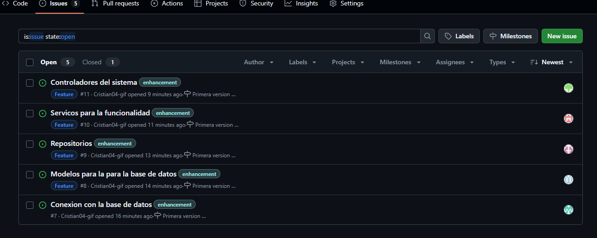
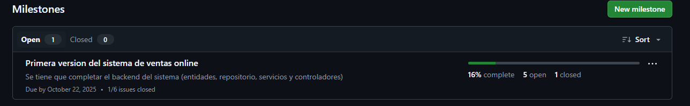
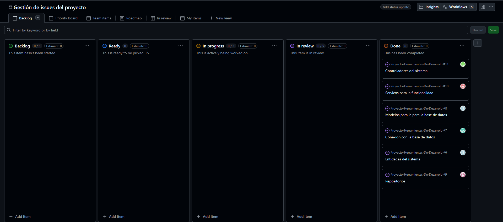

# 💃🛍️ Boutique Online Mar de Moda


___
## ⚙️ Instalación y ejecución
```bash
git clone https://github.com/FabricioUTP/Proyecto-Herramientas-De-Desarrolo.git

cd Proyecto-Herramientas-De-Desarrolo
```
## 💡 Introducción
Boutique Online Mar de Moda es un emprendimiento dedicado a la venta de ropa
femenina a través de una plataforma web. Nos especializamos en prendas superiores como
blusas, tops y camisas, adaptadas a las tendencias actuales y a las necesidades de nuestras
clientas. Nuestro enfoque combina estilo, comodidad y una experiencia de compra
práctica, moderna y segura.

## 🎯 Misión
Brindar a nuestras clientas una experiencia única e innovadora de comprar ropas a través
de un aplicativo web, de una manera moderna y segura desde cualquier lugar del Perú,
ofreciéndoles prendas que se ajusten a los gustos de las clientas, según la temporada del
año.

## 🔭 Visión
Nuestra visión es ser una marca reconocida a nivel nacional, como una de las mejores
boutiques online, ofreciendo una experiencia digital intuitiva, un excelente servicio a
través de nuestro aplicativo web, prendas de alta calidad y una buena gestión del servicio.

## 💻 Tecnologia y procesos actuales
El emprendimiento usa las redes sociales para poder llegar a los usuarios como, por
ejemplo: TikTok, Instagram y WhatsApp. Usa estas herramientas para poder estar en
contacto y por esos mismos medios realizar las compras de las prendas. Si integramos más
herramientas digitales como es el caso del aplicativo web, tendríamos un mayor alcance,
puesto que estaría con pasarelas de pago accesibles y un sistema de gestión de pedidos.

## 📈 Estrategias

|  Expansión y Marketing  |  Seguridad y Operaciones  |
|--------------------------|----------------------------|
|Promociones exclusivas a través de las redes sociales para llegar a más usuarios y visualizaciones.|Respetar las políticas de privacidad para proteger los datos personales de las clientas.|
|Envíos mediante agencias como Shalom, a nivel nacional.|Actualización constante sobre el inventario.|
|Catálogo con prendas accesibles y colores disponibles.|
|Seguir con los canales de difusión.|

## 🗺️ Planes de la empresa

|Objetivos de Expansión|Planes de Seguridad|
|----------------------|------------------------|
|Ampliar la red de alcance de la tienda con campañas en las redes sociales, realizar alianzas con influencers y la integración de métodos de pagos modernos como Yape, Plin y tarjetas de crédito.|Implementar controles de seguridad de los datos de las personas, mantener actualizadas las contraseñas, y poder estar capacitados para la atención al cliente a través de los manuales de usuario y administración|

## 👥 Roles y Créditos
| Nombre | Rol | Funciones |
|--------|-----|-----------|
| Cristian  | Jefe de Proyecto | Coordinación del equipo, gestión de reuniones y planificación de tareas |
| Fabricio | Responsable de Control de Versiones | Administración del repositorio en Git/GitHub, creación y control de ramas, integración de cambios y resolución de conflictos |
| Sandro | Desarrollador Backend | Implementación de APIs, integración con la base de datos y desarrollo de la lógica de negocio |
| Víctor | Desarrollador Frontend | Diseño y desarrollo de interfaces, maquetación responsiva y consumo de APIs |
| Yefli | Desarrollador Full Stack | Diseño y desarrollo de la interfaz de usuario y la lógica del servidor, lo que incluye la gestión de bases de datos, APIs y la experiencia de usuario |

## ✅ Alcances
El presente proyecto abarca el desarrollo e implementación de un aplicativo web para la
boutique online, con el objetivo de mejorar la experiencia de compra de las clientas. Se
contemplan funcionalidades clave que permitirán gestionar productos, pedidos y datos de
manera eficiente y segura, además de asegurar un diseño atractivo, estable y adaptable a
futuras mejoras

## 🚫 Limitaciones
El proyecto presenta algunas limitaciones propias de un emprendimiento nuevo. Estas
pueden influir en el desarrollo y funcionamiento del aplicativo web.
- **Presupuesto limitado:** Debido a que es un emprendimiento, suele pasar que no se tiene
un amplio presupuesto para poder implementar nuevas tecnologías, lo cual puede
restringir la inversión en los desarrolladores.
- **Gestión manual del inventario:** Al realizar manualmente, puede generar errores
comunes al momento de los cálculos, como la falta de actualización de stock y mucho
más.

## 📝 Requerimientos
### Funcionales
- El aplicativo web permite el registro de nuevos usuario mediante un formulario.
- El aplicativo web debe permite el inicio de sesión por correo y contraseña.
- El aplicativo web mostrará el catálogo de prendas filtrando por categorías y temporadas.
- El aplicativo web permite añadir productos al carrito de compras.
- El aplicativo web muestra el detalle de cada compra y prenda.
- El aplicativo web permite realizar el pedido y obtiene una confirmación de compra.
- El aplicativo web permite el seguimiento del estado del pedido.
- El aplicativo web debe enviar notificaciones sobre las promociones, ofertas de los productos.
- El aplicativo web ofrece recomendaciones personalizadas según las preferencias del cliente.
- El aplicativo web permite al administrador iniciar sesión de forma segura.
- El aplicativo web permite gestionar, editar, eliminar productos del catálogo.
- El aplicativo web permite actualizar el stock de los productos, mantenerlo actualizado.
- El aplicativo web genera reportes de ventas semanales o mensuales.
- El aplicativo web permite ver gestionar los pedidos realizados por el usuario.
- El aplicativo web le permite realizar publicaciones.
### No funcionales
- El aplicativo web debe proteger los datos personales de los usuarios.
- El aplicativo web debe tener una interfaz clara e intuitiva que sea fácil de usar.
- La aplicación web debe tener un tiempo prudente para poder recibir la información de los pedidos.
- El aplicativo web debe ser compatible con los navegadores.
- La arquitectura de la aplicación web le debe permitir agregar nuevas
funcionalidades en el futuro

## 🔄 Flujo de Trabajo en Git
1. Clonar el repositorio:
 ```bash
 git clone https://github.com/FabricioUTP/Proyecto-Herramientas-De-Desarrolo
 cd Proyecto-Herramientas-De-Desarrolo
 ```
2. Crear una nueva rama:
 ```bash
 git checkout -b rama-Cristian-Adriano
 ```
3. Revisar estado y añadir cambios:
 ```bash
 git status
 git add .
 ```
4. Realizar un commit:
 ```bash
 git commit -m "README.md actualizado con el conflicto arreglado"
 ```
5. Volver a la rama principal:
 ```bash
 git checkout main
 ```
6. Ver los remotos configurados:
 ```bash
 git remote -v
 ```
7. Ver historial de commits en una sola línea:
 ```bash
 git log --oneline
 ```
8. Crear un tag (versión)
 ```bash
 git tag -a v1.0.0 -m "Primera version con capturas"
 ```

## 📸 Capturas del Proceso

### 1. Clonación del Repositorio


### 2. Uso de Comandos
- **Comando 1**
  
  

- **Comando 2**
  
  

- **Comando 3**
  
  

- **Comando 4**
  
  

- **Comando 5**
  
  

- **Comando 6**
  
  
  ### 3. Configuración de Reglas (Branch & Tags)
*Evidencia de la configuración de reglas de ramas y tags, según la rúbrica.*

.png)
.png)
.png)
.png)
.png)


### 4. Gestión de Proyecto (Issues, Milestones y Tablero)
*Evidencia de la gestión de tareas, hitos y el tablero visual del proyecto.*







### 5. Flujo de Trabajo (Fork, PRs y Revisión Cruzada)
*Evidencia del proceso de Fork, Pull Request, revisión por pares (revisión cruzada), aprobación y merge.*

.jpg)
.jpg)


### 6. Manejo de Conflictos
*Evidencia de la detección y resolución de conflictos de merge.*


.png)
.png)

### 7. Configuración de Organización y Commits
*Evidencia de la creación de la organización y commits iniciales.*


### 8. Manejo de Pull Requests
- **Primer Pull Request**
  
- **Merge a la rama**
  
- **Merge confirmado**
  

### 9. Manejo de Conflictos
- **Archivo en conflicto - versión actual**
  

- **Archivo en conflicto - versión entrante**
  

- **Conflicto creado**
  

### 10. Aprobación del Merge
- **Merge a la rama**
  

- **Merge confirmado**
  

